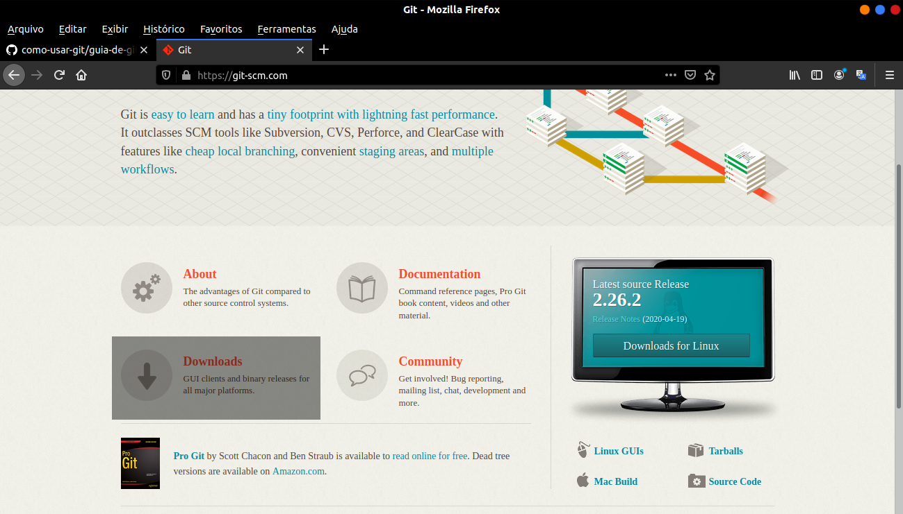

### como-usar-git
<h1 align="center">
	Guia da ferramenta de versionamento, Git e GitHub.
</h1>
 

	<b> &nbsp;&nbsp;&nbsp;&nbsp;&nbsp; Você não sabe o que é Git ou GitHub, ou queria ver melhor o que é, ou ainda, está interessado aprender alguns comandos para aplicar em seus projetos utilizando o Git? </b>

	<b> &nbsp;&nbsp;&nbsp;&nbsp;&nbsp; Então siga esse documento e terá essas, e mais informações sobre como trabalhar com essa incrível ferramenta!</b>

 
 
<ul type="square">
	<li>História do Git e do GitHub:</li>
	 
	

		As ferramentas de versionamento evoluirão muito com o tempo, tanto que só lendo o resumo deste documento, já da para perceber quantas funcionalidade se tem hoje em dia no Git e no GitHub. Vamos viajar no tempo para entender como o Git surgiu e evoluiu tanto até a chegada do GitHub.
	

	
 
		Estamos agora em nos anos 1985, quando o Git ainda não existia, mas o software mais usado para versionamento é o CVS, Software de Controle de Versão, que precisava de um servidor, ou seja é um software centralizado, e que até atendia muitos dos problemas, mas também daixa muito deseja. Uma vez que você carregasse seu arquivos para o servidor, não é mais possível renomeá-los, mudar o diretório, entre outras funcionalidade. Caminhando um pouco mais, nesta nossa linha do tempo da evolução do Git, chegamos em 2000, onde um dos softwares, agora, mais utilizado, é o Subversion, que se semelhante bastante ao CVS, é Open Source, código aberto, Centralizado, necessita de um servidor, e esta tentando resolver os problemas que se tem no CVS. Ainda no ano 2000, temos também, o software BitKeeper, que diferente dos dois ditos anteriormente, é um software distribuído, um software livre, com versão comunidade, porem é proprietário, o que daqui uns meses será um grande problema, pois o Kernel do Linux, esta sendo desenvolvido, com a utilização dessa ferramenta. Então pense comigo, um Sistema Operacional totalmente livre, estar sendo desenvolvido com uma ferramenta proprietária, vamos concordar que pode dar um grande problema mais a frente não é? E foi exatamente isso que um dos defensores dos softwares livres, Richard Stallman, pensou e não concordou. Isso foi uns dos motivos para a criação do Git. Mas o principal motivo, aconteceu quando o BitKeeper, por conta de um problema com um programador usuário da ferramenta, lançou uma nova licença do Software, licença, essa que continha muitas limitações aos que utilizavam da versão comunidade. E assim, como o Linus Torvalds (o principal desenvolvedor do Linux, o que desenvolveu o nucleo do sistema operativo) utilizava essa versão, não gostou nada disso, e resolveu fazer seu próprio software de versionamento, o Git, que é de software livre, distribuído, complexo, porem mais performativo e Open Source. Então como podemos ver, o Git, foi um software criado por meio de uma ‘briga’ de desenvolvedores, que agora é a melhor ferramenta de controle de versão, feita em apenas 4 dias. É isso mesmo, porem lançado apenas em 7 de abril de 2005.
	

	

		Após o lançamento do Git e ele ter feito muito sucesso, um grupo de quatro desenvolvedores (Tom Preston Werner, Chris Wanstrath, P. J. Hyett e Scott Chacon), criaram o GitHub uma plataforma de hospedagem de código, bem semelhante ao SourceForge, porem se tornou mais popular em 2011 e mais utilizado. É um software baseado no Git, e proprietário. Atualmente ele pertence a Microsoft, ela comprou o GitHub em 2018, por conta da desmotivação dos fundadores do software por um ataque de DDOS, que acabou quebrando a plataforma. Então com esse ataque, eles acabaram vendendo o Software para Microsoft por 7.5 bilhões de dólares. Curiosidade, esse ataque parou a internet de todo o mundo, e foi registrado como o maior ataque de DDoS de todos os tempos. Um ataque DDoS  é uma tentativa de tornar os re	cursos de um sistema indisponíveis para os seus utilizadores, uma invalidação por sobrecarga, que pode forçar o sistema vítima a reinicializar ou consumir todos os recursos de forma que ele não possa mais fornecer seu serviço ou obstrui a mídia de comunicação entre os utilizadores e o sistema vítima de forma a não se comunicarem adequadamente.
	
	
	

	<li>O que é Git e GitHub e para que serve?</li>
	 
	
	
		Depois de ler toda a história da evolução do Git, você já deve ter uma noção do que faz essa ferramenta. O Git, como já dito, é uma software de controle de versões. Onde após instalado e configurado, e iniciá-lo em um determinado repositório, ele controla todas modificações que as arquivos desse repositório ira passa, e guarda um histórico com essas modificações, desde que cada vez que você modifique os arquivos, você faça um commit. Um Commit, é o ponto de transição que se tem onde os arquivos estão salvos em seu repositório local, e o histórico desses commits, no git. E o que se tem antes do commit anterior e esse, é a diferença desse arquivo, a diff desse arquivo. Então com o Git, podemos guardar as versão que nosso projeto passou até chegar onde ele está, navegar entre essas versões até voltar em uma versão existente, ver a diferença dos arquivos para ver o que foi modificado, podemos também criar paralelos do projeto, e muitas outros funcionalidade que veremos ao decorrer desse documento, acompanhe.
	
	
	

	<li>Iniciando aos primeiros comandos:</li>
	 
	<ul type="circle">
	<li>Instalando o Git:</li>
	 
	

		Agora que você, se não sabia, já sabe o que é o Git, está pronto para continuar e ver os principais comandos que se deve saber, que irão facilitar a sua vida, seja você um simples usuário afim de tal ferramenta, ou até mesmo um programador júnior ou experiente. Mas antes, temos que instalar o Git, e isso é bem simples de se fazer. Para usuários do sistema linux, basta digitar no terminal o seguinte comando:
	
	
	<code>
	<pre>
		$sudo apt install git
		(Comando significa: Com os privilegios de administrador, instale o git)
		(após isso digite sua senha e aperte enter)
	</pre>
	</code>
	

		Mas se tiver usando outro sistema, acesse o site oficial  do  git, clicando aqui, clique em download e clique no sistema operacional que você esta usando. 
	
	

		Se você estiver usando Windows, ele sera intalado automiticamente, e se for Mac OS X, o site te dira o que fazer.
	

	

	
	
	<li>Iniciando com o Git:</li>
	 
	

		Você precisara fazer algumas configurações em seu git apos instalar em sua maquina, e para começar os seus projetos, crie uma pasta para guardar seus projetos. 
	

	

		Obs.: Este guia estará sempre mostrando comandos no terminal para o Linux, se quiser usar outro sistema, os comandos do git, seram os mesmos, mas talvez, precise dar uma pesquisada melhor, pois alguns comandos do linux, é diferente de outros sistemas.
	

	<code>
	<pre>
		$ git config --global user.name "seu nome"
		(configurar seu nome)
		$ git config --global user.email seu email
		(configurar seu email)
		$ git config --global core.editor "seu editor"
		(configurar seu editor padrão como o VS Code ou Sublime)
		$ mkdir nome do diretório 
		(Diretório de projetos)
		$ git init nome do repositório criado
		(Aqui o git é iniciado em seu repositório com uma pasta .git)
		cd nome do diretório
		(aqui nos entramos no diretório que você ira salvar seus arquivos)
	</pre>
	</code>
	

		Pronto! Agora você tem o git configurado com seu nome, e-mail, editor e em sua pasta, assim poderá começar seus projetos, para ver suas configuração digite o comando:
	

	<code>
	<pre>
		$ git config --list
		clear
		(Para apagar tudo e começar a trabalhar, comando opcional)
	</pre>
	</code>	
	

	<li>Criando nossos arquivos:</li>
	 
	

		Agora vamos criar nossos arquivos, todo repositório tem como padrão, criar um README.md e um LICENSE. No README.md, você descreve seu projeto, colocando para que ele serve, e algumas informações adicionais, e o LICENSE, para escrever qual sua licença quado for jogar isso em uma máquina remota como o github, e provavelmente você ira escolher a licença MIT.
	

	<code>
	<pre>
		$ touch README.md
		(criar um arquivo chamado README, você também pode trazer um arquivo já pronto)
		$ touch LICENSE
		(criar um arquivo chamado LICENSE)
		$ git add README.md
		$ git add LICENSE
		(até agora o repositório estava apenas em seu diretório, agora você o adicionou ao git)
	</pre>
	</code>
	

		Pronto! agora você tem os dois arquivos padrão e agora adicione os arquivos que você quiser como seu projeto, seu site, ou somente seus lembretes mesmo se quiser.
	
	
	

	<li>Primeiro commit:</li>
	 
	

		Agora vamos salvar esses arquivos em seu git, pois até agora você criou dois arquivos e os adicionou ao git, porem para salvar esses arquivos no git é necessário dar o commit, que salva as alterações, se você quiser ver o status de seu git digite `git status`, e agora você vê que tem arquivos não salvos e para salvá-los vamos fazer nosso commit.
	

	<code>
	<pre>
		$ git commit -m "Primeiro commit"
		(fazendo commit)
		$ git status
		(ver que não ha mais alterações)
		$ git log
		(ver seus commits)
	</pre>
	</code>
	

		Você pode adicionar os arquivos no git e na mesma linha já criar um commit com o comando `$ git commit -am "Primeiro commit"`. Esse - a atrás do - m vem de adicionar e o - m de minimizar, ou seja, um commit simples com descrição.
	
	
	

	<li>Modificando arquivos:</li>
	 
	

		Se você quiser adicionar um arquivos, ou modificá-los, tera que fazer um novo commit, para que ele carregue essas modificações para o git. E você pode modificar, abrindo seu editor, ou por comando mesmo, vamos supor que você queira acrescentar algo em seu README.md, pois por enquanto você só adicionou ele mais não colocou nada:
	

	<code>
	<pre>
		$ echo "Esse arquivo é feito para..." > README.md
		(escrever em README.md)
		$ git status
		(ver o status dos arquivos)
		$ git commit -m "Escrevi em README.md"
		(Comite as alterações)
		$ git status
		(ver o status)
		$ git log
		(ver os commits)
		$ echo "Alterando arquivo" >> README.md
		(fazer alterações em README, >> para acrescentar linha)
		$ git commit -m "Adicionando linha em README.md"
	</pre>
	</code>
	

		Pronto! Agora você pode adicionar, renomear e modificar os seus arquivos e após isso é só gerar um commit para salvar.
	

	

		*Obs.: o README.md pode ser escrito em markdown, que é uma linguagem de hipertexto para documentos.
	
	
	

	<li>Voltando em versões anteriores:</li>
	 
	

		Se você fez uma modificação em um determinado arquivo e agora percebeu que acabou dando problema e precisa da versão anterior, o git também faz isso para você. Cada commit tem um código, e precisaremos deste código para poder voltar. Você pode consultar ele com o comando `$ git log`.
	

	

		E agora se juntarmos esse código ao comando abaixo, poderemos então restaurar o projeto antes do commit, ou em qual commit você quiser.
	

	<code>
	<pre>
		$ git log
		(consultar o código)
		$ git reset --hard codigo
		(volta no commit que selecionou)
	</pre>
	</code>
	

		E agora você não pede mais os arquivos modificados.
	

	
	
	

	<li>Navegando entre as branch:</li>
	 
	

		As branch, podem serem entendidas como versões do seu projeto, de padrão se inicia com a branch master, onde você adiciona, renomeia e modifica seus arquivos. Mas você pode sambem ter uma branch teste e após comitar em seu projeto e ver que pode adicionar ou testar um recurso, você pode adicionar uma nova versão como a teste e modificar testar e fazer o que quiser nela que na branch master estará intacta. Vamos fazer alguns testes para entender melhor esse recurso.
	

	<code>
	<pre>
		$ git branch
		(Ver em qual branch estamos)
		$ git branch teste
		(Cria uma nova branch)
		$ git checkout teste
		(Ir para branch teste)
		(Agora podemos modificar arquivos)
		$ git commit --m "Modificação em nova branch"
		(Fazer o commit em nova branch)
		$ git checkout master
		(Voltar para branch master)
		$ git status
		(Ver que nada mudou nesta nova branch)
		git branch
		(Ver que mudamos para essa nova branch)
	</pre>
	</code>	
	

	<li>Comando diff:</li>
	

		Quando estamos trabalhando com dois arquivos é possível tirar a diferença entre eles, ou seja, o Path entre eles, e o comando diff faz exatamente isso, tira o Path dos arquivos.
	

	<code>
	<pre>
		$ git diff
		(Tirar a diferença)
	</pre>
	</code>
	

		Agora você pode ver tudo que foi modificado e fazer seu commit. É possível também com o comando diff ver só quais arquivos foram modificados:
	

	<code>
	<pre>
		$ git diff --name-only
		(Ver os arquivos modificados)
	</pre>
	</code>
	

		Também é possível tirar a diff de apenas um arquivo em especifico, como por exemplo:
	

	<code>
	<pre>
		$ git diff nome do arquivo
		(ver a diferença entre determinado arquivo)
	</pre>
	</code>	
	

	<li>Revertendo modificações de um único arquivo:</li>
	 
	

		Aprendemos como reverter commits e trazer novas modificações, mas e se você modificou vários arquivos e quer voltar apenas um arquivo em como ele estava antes do commit anterior. E então precisaremos aprender um novo comando:
	

	<code>
	<pre>
		$ git checkout HEAD -- nome de arquivo
		(trazendo as configurações anteriores)
	</pre>
	</code>
	

		Agora podemos, no branch que estamos através do comando HEAD, voltar, com o comando checkout, para o estado anterior.
	
	
	

	<li>Salvando no GitHub:</li>
	 
	

		Você precisara agora salvar seus projetos no GitHub, pois ate agora, os arquivos estão salvos apenas em sua maquina local, você precisa passar isso para uma maquina remota como o GitHub. E para fazer isso você precisara fazer uma conta no GitHub, se não tiver e criar um repositório.
	

	
 
		Após isso, você precisara dar um push, ou seja, enviar o repositório que esta em sua maquina para o GitHub, criando uma SSH e configurando ela no Git onde tem a opção configurações. E para fazer isso, você precisa gerar uma chave ssh e por ela passar seus arquivos para o github. Primeiro vamos gerar essa chave ssh com o seguite comando:
	

	<code>
	<pre>
		$ ssh-keygen -t rsa -b 4096 -C "your_email@example.com"
		(gerar chave ssh)
		(obs.: o e-mail deve ser o mesmo que o do github)
		(e assim, ele mostrara onde ele ira salvar a chave publica e a privada, aperte [enter])
		(depois informe sua senha e depois confirme ela novamente)
	</pre>
	</code>
	

		Agora precisamos passar essa chave para o GitHub e transferir os arquivos. Entre no local onde ele baixou a chave, copie essa chave (não o arquivo, o conteúdo dele), acesse seu GitHub clique em seu avatar do canto superior direito e clica em setings. Após isso clique em ssh and gpq keys, crie uma nova ssh e cole a chave na opção informada, e escreva um titulo, que lembre seu pc por exemplo <seu usuário> home.
	

	

		Pronto! você agora tem uma chave ssh, vamos passar os arquivos através dessa chave. Escreva em seu terminal:
	

	<code>
	<pre>
		$ git remote add origin https://<o endereço de seu repositório do github>.git
		(adicionar repositório origin em ...)
		(você pode ver se ele adicionou com git remote)
		$ git push -u origin master
		(da um push do branch master para o repositório origin)
	</pre>
	</code>
	

		Pronto! você já tem o repositório no GitHub, basta atualizar seu GitHub que o repositório estará lá.
	
	
	

	<li>Dando Push e Pull:</li>
	 
	

		Se você ainda não sabe, Push é basicamente que empurrar, e quando se aplica ele no termina ou manda o GitHub dar um Push, é o mesmo que dizer empurre, ou transfira os arquivos para o GitHub. Já o Pull, busca arquivos alterados do GitHub para sua maquina. E além desses, ainda tem outro termo importante que vale citar, o fetch, que é usado para atualizar o repositório local, para ver se não foram feita nenhuma alteração do GitHub, sim da para alterar pelo GitHub 
	

		Para dar esse comandos é bem simples, basta digitar:
	

	<code>
	<pre>
		$ git push origin master
		(empurrar os arquivos para o GitHub)
		$ git pull origin master
		(puxar do GitHub)
		$ git fetch origin master
		(atualizar os arquivos local)
	</pre>
	</code>
	
	
	

	<li>Ignorando arquivos:</li>
	 
	

		Ignorar um arquivo no GitHub, é arquivar sem que mostre como um arquivo escondido, e para fazer isso, crie um arquivo chamado .gitignore, e nele coloque o que você quer deixar oculto, ou seja, ignorar. Escreva no arquivo que você criou, o nome dos arquivos que você quer ignorar.
	
	
	

	<li>Comando git revert:</li>
	 
	

		Esse comando tambem serve para reverter as ações, porem ele não perde as alterações, pois ele deixa o commit das alterações la, e cria um novo com a situação anterior. E se você quiser pegar de novo essas alterações, ela esta salva em seus commits e você só precisa dar um reset --hard:
	

	<code>
	<pre>
		$ git revert --no-edit <codigo do commit que deu o problema>
		(faz um novo commit com a situação anterior do commit que deu o problema)
		</pre>
	</pre>
	</code>	
	

	<li>Adicionando e Deletando branchs remotos e locais:</li>
	 
	

		Para enviar seus branchs para o seu repositório remoto, é só substituir o push de branch master para <nome do branch>, mas se você quer deletar esse branch que você já criou, escreva: 
	

	<code>
	<pre>
		$ git branch
		(consultar o branch)
		$ git checkout nome do branch
		(muda o branch)
		$ git push origin nome do branch
		(envia o branch para o repositório remoto)
		$ git branch
		(consultar o branch)
		$ git push origin nome do branch
		(remover branch do repositório remoto)
		$ git checkout master
		(ir para branch master)
		$ git branch -D teste
		(remover no repositório local)
	</pre>
	</code>	
	

	<li>Clonando Projetos:</li>
	 
	

		Na verdade isso é bem simples, é preciso apenas pegar a url do projeto que você que clonar e escrever:
	

	<code>
	<pre>
		$ git clone link
		(clone o repositório tal)
	</pre>
	</code>
	

		Não é possível dar push já que você clonou um projeto que já pertencia a alguém, se você quiser dar push em um projeto que não é seu, é preciso fazer um fork do projeto pronto, clonar ele e ai sim dar seu push.
	
	
	

	<li>Dicas Finais:</li>
	 
	

		1. Se você quer excluir um arquivo ou renomear do repositório remoto, pode fazer isso de seu terminal digitando o comando git remote, e após a ação que quer fazer, seja ela remover ou renomear.
	

	

		2. Navegar entre suas branch é muito importante pois com isso, você pode recuperar seus arquivos fazendo testes em outras branch.
	

